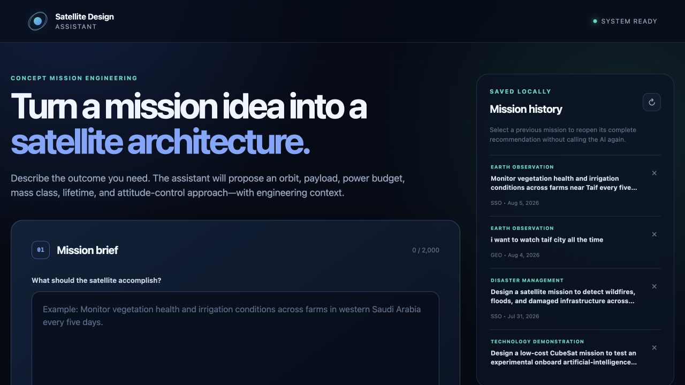
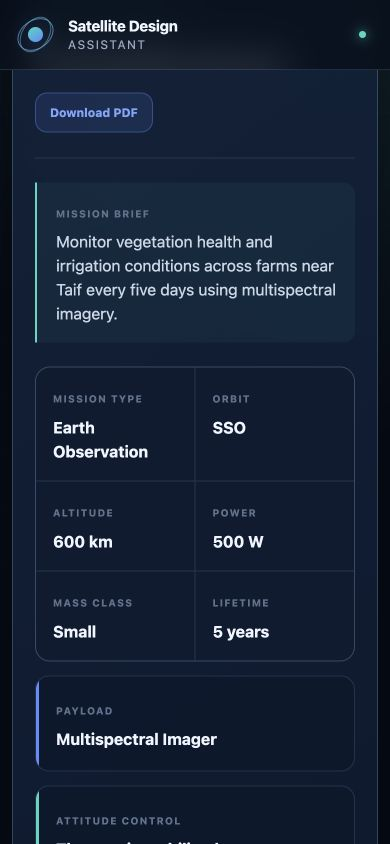

# Satellite Design Assistant

An AI-assisted conceptual design tool that turns a plain-language mission brief into a saved satellite architecture. It recommends a mission type, orbit, altitude, payload, power level, mass class, lifetime, and attitude-control approach, then combines that result with a curated engineering knowledge base.

> Conceptual recommendations are for early design exploration. A qualified spacecraft engineering team must verify all values before mission implementation.



## What the application does

- Accepts a satellite mission description in the browser.
- Calls the OpenAI Responses API and validates the returned design strictly.
- Supports eight mission classes: Earth Observation, Communication, Navigation, Weather Monitoring, Remote Sensing, Scientific Research, Technology Demonstration, and Disaster Management.
- Retrieves matching engineering knowledge from SQLite.
- Saves the mission and recommendation in one database transaction.
- Lists, reopens, and deletes previous missions without repeating the AI call.
- Produces a downloadable two-page PDF containing the complete recommendation and engineering context.
- Presents clear loading, success, configuration, validation, API, and not-found states.
- Adapts to desktop and mobile screens.



## System architecture

```text
Browser (HTML + CSS + JavaScript)
            |
            | JSON / PDF over HTTP
            v
Flask API (app.py)
     |              |
     v              v
OpenAI adapter    ReportLab PDF
(ai_api.py)       (reports.py)
     |
     v
Validated design pipeline
     |
     v
SQLite + engineering knowledge
(db.py, satellite.db, knowledge_base.json)
```

The five core components work together as follows:

1. The frontend sends `POST /analyze` with a mission description.
2. `ai_api.py` requests and validates an AI recommendation.
3. `db.py` retrieves the matching knowledge record and saves the mission plus recommendation atomically.
4. `app.py` returns the complete combined result to the frontend.
5. `reports.py` can regenerate the saved result as a PDF without another AI request.

## Project structure

```text
satellite-design-assistant/
├── .env                              # Local secret; excluded from Git
├── .vscode/settings.json             # Project virtual-environment selection
├── README.md
├── venv/                             # Local environment; excluded from Git
├── week1/ ... week3/                 # Training exercises and source pipeline
└── week4/final_project/
    ├── app.py                        # Flask app and HTTP routes
    ├── ai_api.py                     # OpenAI request and response validation
    ├── db.py                         # SQLite schema and CRUD operations
    ├── reports.py                    # ReportLab PDF generator
    ├── satellite.db                  # Final application database
    ├── knowledge_base.json           # Curated engineering knowledge
    ├── requirements.txt
    ├── bugs.txt                      # Verification and issue log
    ├── static/
    │   ├── css/style.css
    │   └── js/app.js
    ├── templates/index.html
    ├── tests/
    ├── docs/                         # Real application screenshots
    └── output/pdf/
        └── sample-satellite-design.pdf
```

## Requirements and installation

- macOS, Linux, or Windows
- Python 3.11 or newer
- An OpenAI API key

From the repository root:

```bash
python3 -m venv venv
venv/bin/python -m pip install -r week4/final_project/requirements.txt
```

On Windows, replace `venv/bin/python` with `venv\Scripts\python.exe`.

Create or update the repository-level `.env` file:

```dotenv
OPENAI_API_KEY=your_api_key_here
OPENAI_MODEL=gpt-4.1-mini
FLASK_PORT=5000
FLASK_DEBUG=false
```

The `.env` file and `venv/` directory are excluded from Git. Never commit an API key.

## Run the application

```bash
venv/bin/python week4/final_project/app.py
```

Open [http://127.0.0.1:5000](http://127.0.0.1:5000) in a browser.

### VS Code Run button

1. Open the `satellite-design-assistant` folder itself in VS Code.
2. Open `week4/final_project/app.py`.
3. Confirm the selected interpreter ends with `satellite-design-assistant/venv/bin/python`.
4. Click **Run Python File**.
5. Open `http://127.0.0.1:5000`.

The repository settings point VS Code at this virtual environment. Opening the parent `KACST` folder instead will resolve the interpreter path incorrectly.

## How to use it

1. Enter a mission goal with the target area, desired observation or service, and timing needs.
2. Select **Analyze mission** and wait for the AI response.
3. Review the design metrics, engineering rationale, drivers, subsystems, advantages, and limitations.
4. Select **Download PDF** to save the report.
5. Reopen a saved mission from **Mission history** without using the AI again.
6. Use the × control to delete a mission after confirming the action.

Example brief:

> Monitor vegetation health and irrigation conditions across farms near Taif every five days using multispectral imagery.

## HTTP API

| Method | Route | Purpose | Success |
|---|---|---|---|
| `GET` | `/` | Web interface | `200` |
| `GET` | `/health` | Service health | `200` |
| `POST` | `/analyze` | Analyze and save `{"description": "..."}` | `201` |
| `GET` | `/missions` | List saved missions | `200` |
| `GET` | `/mission/<id>` | Retrieve one complete saved result | `200` |
| `DELETE` | `/mission/<id>` | Delete a mission and recommendation | `200` |
| `GET` | `/download/<id>` | Download a saved recommendation as PDF | `200` |

Error responses are JSON and use appropriate HTTP codes, including `400`, `404`, `413`, `422`, `502`, and `503`.

## Tests

Run the automated acceptance suite from the repository root:

```bash
venv/bin/python -m pytest -q week4/final_project/tests
```

The suite verifies:

- All eight mission types.
- Valid and invalid AI response structures.
- Empty, short, oversized, and malformed requests.
- Analyze, list, detail, and delete routes.
- SQLite knowledge seeding and cascade deletion.
- PDF response headers and file structure.

Current result: **26 tests passed**. A real OpenAI analysis, desktop browser flow, mobile layout, and rendered PDF were also verified during final acceptance.

## Configuration

| Variable | Default | Description |
|---|---|---|
| `OPENAI_API_KEY` | none | Required only when performing an analysis |
| `OPENAI_MODEL` | `gpt-4.1-mini` | OpenAI model used for conceptual designs |
| `FLASK_PORT` | `5000` | Local server port |
| `FLASK_DEBUG` | `false` | Enables Flask debug mode when set to `true` |
| `DATABASE_PATH` | `week4/final_project/satellite.db` | Optional database override |
| `KNOWLEDGE_BASE_PATH` | `week4/final_project/knowledge_base.json` | Optional seed-file override |

## Technologies

Python, Flask, Flask-CORS, OpenAI Responses API, SQLite, ReportLab, HTML5, CSS, JavaScript Fetch API, and pytest.
